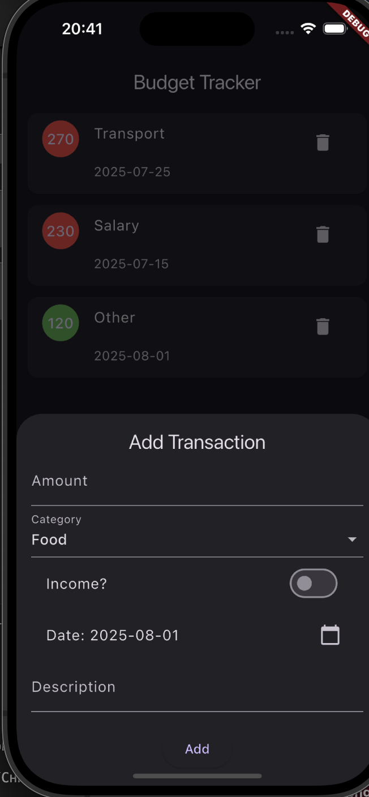
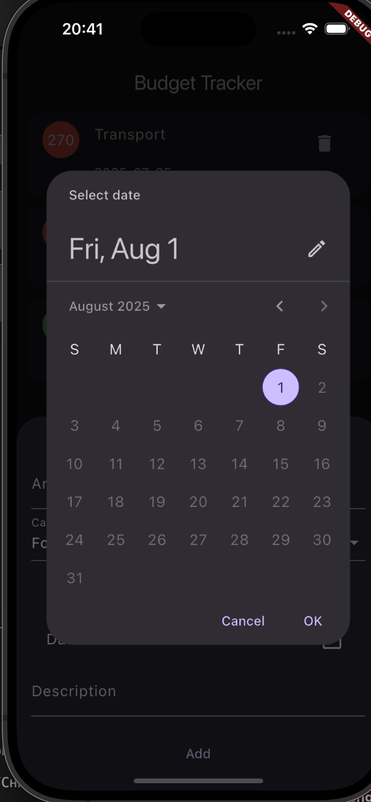

💰 Budget Tracker App
Приложение для удобного учёта личных финансов — расходов и доходов с категоризацией и визуализацией статистики.

✨ Особенности
➕ Добавление доходов и расходов с указанием категории, даты и описания

📊 Подсчёт общего баланса

🗂️ Просмотр списка транзакций с возможностью удаления

📈 Визуализация данных с помощью красивых графиков (Pie Chart и Line Chart)

🌙☀️ Тёмная и светлая темы с удобным переключением

📝 Удобный интерфейс с модальным окном для добавления транзакций

🔍 Фильтрация и сортировка (в планах)

💾 Локальное хранение данных с использованием Hive

🛠️ Технологии
🐦 Flutter + Dart

📦 State management — Provider

📚 Локальное хранение — Hive и hive_flutter

📊 Графики — fl_chart

🔑 UUID для уникальных ID транзакций

🎨 Material Design с кастомными элементами UI

